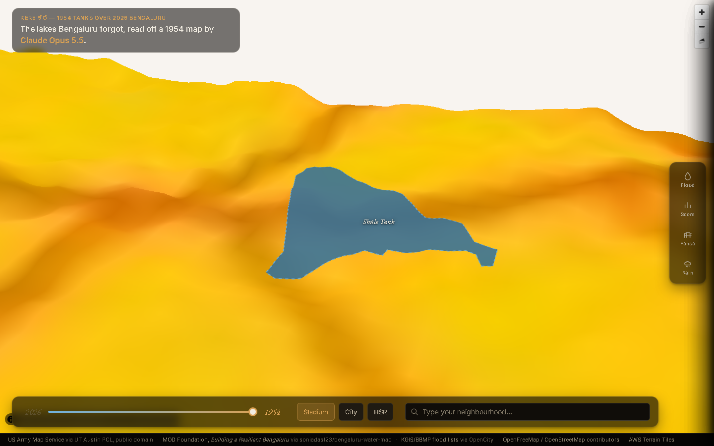
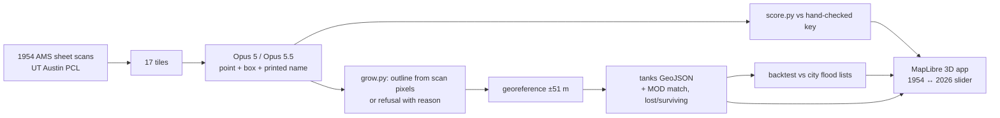

# Kere

**The lakes Bengaluru forgot, read off a 1954 US Army map by Claude Opus 5.5.**

Built for the Bangalore Claude Opus Build Day (26 Sept 2026), Breakthrough track. Start with `IDEA.md` for the pitch and `CLAUDE.md` for the build spec. The test images are in `testset/`: you don't need to take any photos.

## Finding

Of 396 official flood points (KGIS/BBMP), **20% lie within 250 m of a lake the city lost, against 8% of random points (2.55×, p ≈ 1e-14)**. Near lakes it kept, the share is 13% against 17% (0.77×). To reproduce it: `python scripts/backtest.py --area gba`.

## Test the models tonight (about 10 minutes)

```bash
pip install -r requirements.txt
python scripts/build_testset.py          # regenerates the contrast-stretched plan (not shipped, 7 MB); ~20 s
pytest -q                                   # 6 tests: grower, georef, backtest finding, scorer
export ANTHROPIC_API_KEY=sk-ant-...
python eval/run_eval.py --runs 1 --tiles plan_r2c2 front_se   # 4 calls, check it works
python eval/run_eval.py                     # 2 models x 17 tiles x 3 runs
python eval/score.py                        # results/scoreboard.md + results/overlays/
```

**No API key?** Use `testset/quick_set/`. Upload each image to claude.ai with its `_prompt.txt`, in a new chat per image, once with Opus 5 and once with Opus 5.5. Save each reply to a file, then run:

```bash
python eval/add_manual.py --model claude-opus-5-5 --tile plan_r2c2 --file reply.txt
python eval/score.py
```

## Run the app

```bash
python pipeline/assemble.py --model claude-opus-5-5   # (or --results results_standin, see below)
python pipeline/assemble.py --model claude-opus-5
python pipeline/export.py                             # writes everything under app/data/
python -m http.server -d app 8000                      # http://localhost:8000
```

`assemble.py` turns saved model answers (`results/raw/<model>/*.json`) into georeferenced tank
outlines: it clusters points across tiles and runs, keeps a cluster only with 2-of-3-run
consensus, and grows the outline from the scan's own pixels (`pipeline/grow.py`) — never from a
model-drawn box. `export.py` builds everything else the static app reads: the sepia 1954 sheets,
crops, flood points, the search gazetteer, and the scoreboard/backtest numbers.

**No API key yet, or haven't run the eval?** `python scripts/make_standin_results.py` builds
`results_standin/` from the hand-traced answer key (perfect, by construction) so the whole
pipeline and app can be built and tested end to end before spending real API calls — run
`assemble.py --results results_standin` instead. The app then reads `app/data/demo_data.json`
and shows a red "DEMO DATA: answer key, not model output" banner automatically; nothing about the
real eval is faked. As soon as `results/scoreboard.json` exists (it does, in this repo — see
below), `export.py` switches to it and the banner goes away on the next export automatically.



**P2 (optional, built): rain pooling.** `python pipeline/rain.py` fetches the same AWS Terrarium
DEM tiles the app uses for 3D terrain and runs priority-flood depression filling to find where
today's terrain traps water — unrelated to the 1954 lakes. A 5th drawer ("Rain pooling") reveals
it over ~3s, always labelled "not a flood prediction". See `docs/screenshots/rain_*.png`.

## Scoreboard

Real Opus 5 vs Opus 5.5 results (102 calls: 2 models × 17 tiles × 3 runs, same prompt/effort,
`results/scoreboard.md`). This table is regenerated by `eval/score.py`; the "Hand-traced" column
comes from the answer key itself (`testset/`, `data/plan_tanks.geojson`), not a model.

| metric | Opus 5 | Opus 5.5 | Hand-traced |
|---|---|---|---|
| Plan: unique tanks found (of 18) | 18.0 ± 0.0 | 18.0 ± 0.0 | 18 |
| Plan: invented tanks per run | 3.7 ± 1.5 | 4.0 ± 1.0 | 0 |
| Plan: printed names read exactly | 88% | 88% | 100% |
| Plan: extent (box IoU) | 69% ± 1 | **86% ± 0** | 1.00 |
| Front: verified tanks found | **52% ± 4** | **90% ± 4** | 100% |
| Front: invented (no blue ink) | 11.0 ± 1.0 | 1.0 ± 1.0 | 0 |
| Cost, all runs (USD) | $1.74 | $1.20 | $0 |
| Mean latency per call (s) | 14.2 | 9.8 | — |

**The Breakthrough sentence:** both models find all 18 plan tanks, but on the harder 1:250,000
colour front sheet Opus 5.5 reads far better — 90% verified recall vs 52%, and 1 invented tank per
run vs 11 — while also being faster and cheaper per call. Plan-sheet extent accuracy is also
notably better (86% vs 69% box IoU). Both models over-invent slightly more than the hand-traced
key on the plan sheet (the "traps" tiles: reservoirs, the racecourse, built-up shading) — that gap
is real and shown honestly rather than tuned away.

## Known issues

- **`pipeline/grow.py`'s front-sheet resolution limit.** `grow.py`'s thresholds (`MIN_AREA=150`
  px, etc.) were tuned and validated only against the plan sheet (`tests/test_grow.py`). At the
  front sheet's native 1:250,000 scan resolution, several of the 16 known front tanks have under
  150 connected pixels of blue ink and are correctly refused as "too small" by the same,
  unmodified threshold — a real scan-resolution limit, not a bug, and not something we tuned
  (per CLAUDE.md, `grow.py`'s thresholds are frozen). These refusals show up honestly in the
  Fence panel. See `tests/test_assemble.py` for the exact accounting.

## How it works



The model only points. The outline comes from the map's own pixels, and a point with no water drawn under it is refused and shown as refused.

## Credits

- US Army Map Service, Series U502, sheet ND 44-13 (public domain), from the Perry-Castañeda Library, UT Austin.
- MOD Foundation, *Building a Resilient Bengaluru* (water bodies), via github.com/soniadas123/bengaluru-water-map.
- KGIS / BBMP flood points via OpenCity (public domain).
- OpenFreeMap and OpenStreetMap contributors.
- AWS Terrain Tiles.
