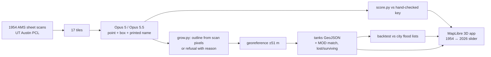

# Kere

**The lakes Bengaluru forgot, read off a 1954 US Army map by Claude Opus 5.5.**

Built for the Bangalore Claude Opus Build Day (26 Sept 2026), Breakthrough track. Start with `IDEA.md` for the pitch and `CLAUDE.md` for the build spec. The test images are in `testset/`: you don't need to take any photos.

## Finding

Of 396 official flood points (KGIS/BBMP), **20% lie within 250 m of a lake the city lost, against 8% of random points (2.55×, p ≈ 1e-14)**. Near lakes it kept, the share is 13% against 17% (0.77×). To reproduce it: `python scripts/backtest.py --area gba`.

## Test the models tonight (about 10 minutes)

```bash
pip install -r requirements.txt
python scripts/build_testset.py          # regenerates the contrast-stretched plan (not shipped, 7 MB); ~20 s
pytest -q                                   # 6 tests: grower, georef, backtest finding, scorer
export ANTHROPIC_API_KEY=sk-ant-...
python eval/run_eval.py --runs 1 --tiles plan_r2c2 front_se   # 4 calls, check it works
python eval/run_eval.py                     # 2 models x 17 tiles x 3 runs
python eval/score.py                        # results/scoreboard.md + results/overlays/
```

**No API key?** Use `testset/quick_set/`. Upload each image to claude.ai with its `_prompt.txt`, in a new chat per image, once with Opus 5 and once with Opus 5.5. Save each reply to a file, then run:

```bash
python eval/add_manual.py --model claude-opus-5-5 --tile plan_r2c2 --file reply.txt
python eval/score.py
```

## How it works



The model only points. The outline comes from the map's own pixels, and a point with no water drawn under it is refused and shown as refused.

## Credits

- US Army Map Service, Series U502, sheet ND 44-13 (public domain), from the Perry-Castañeda Library, UT Austin.
- MOD Foundation, *Building a Resilient Bengaluru* (water bodies), via github.com/soniadas123/bengaluru-water-map.
- KGIS / BBMP flood points via OpenCity (public domain).
- OpenFreeMap and OpenStreetMap contributors.
- AWS Terrain Tiles.
